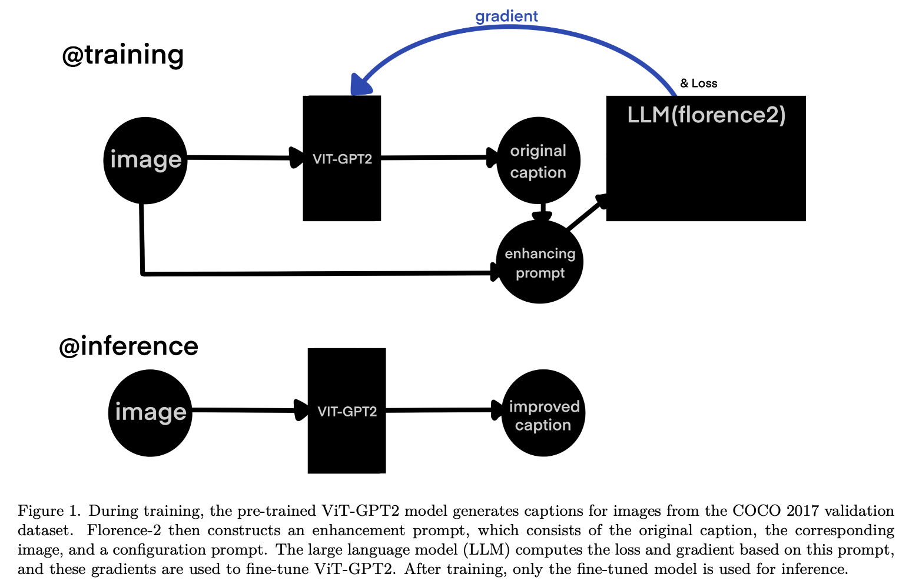
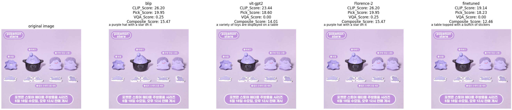
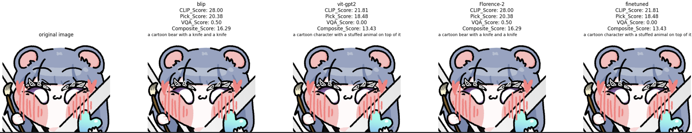
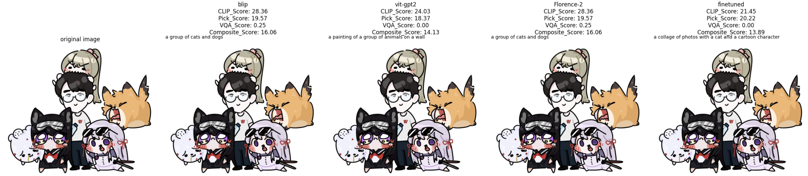

## Improving Image Captioning Using LLM Gradient
LLM, Textgrad, Co-domain AI
# Overview
Lightweight image captioning models, such as ViT-GPT2, often struggle with global contextual understanding and geometric reasoning when dealing with images containing multiple objects or non-standard shapes (e.g., deformities). However, the practical application of image understanding models necessitates stable performance across diverse scenarios. This project aims to overcome these limitations of lightweight models and construct a high-efficiency, high-quality captioning system suitable for resource-constrained environments like AR headsets and mobile platforms.

To achieve this, we leverage the human judgment similarity of a Large Language Model (LLM) to guide the improvement of a lightweight model, introducing a gradient-based LLM guidance approach inspired by the TextGrad technique.

* Core Model Integration: We combine the efficiency of the lightweight ViT-GPT2 model with the semantic expressiveness of a large model like Florence-2.
* Primary Goal: To reduce hallucination in complex, multi-object images and significantly improve alignment with human judgments.
* Evaluation Target: Confirm qualitative improvement and achieve at least maintenance or enhancement in quantitative metrics like Pick Score.

# Methodology & Implementation
The proposed solution implements an iterative caption refinement and fine-tuning pipeline , drawing inspiration from the TextGrad technique, where the LLM provides gradient-based feedback to refine the captions generated by the lighter vision model.

**Gradient-Based LLM Guidance (TextGrad Application)**

To transfer the semantic capabilities of the LLM to the lightweight model, we leverage a gradient-based guidance mechanism.
* Initial Caption Generation: The ViT-GPT2 model generates an original caption for the input image.
* LLM Evaluation and Loss Formulation:

The Florence-2 (LLM) receives the image and the original caption. The LLM evaluates the ViT-GPT2 output against human expectations based on an enhancing prompt. It calculates a prompt-based loss and generates gradients based on this loss.
* Iterative Fine-Tuning: The derived gradients are used to fine-tune the parameters of the ViT-GPT2 model. This process iteratively performs caption refinement, evaluation, and fine-tuning.

**Prompt Engineering for Caption Refinement**

Prompts were carefully constructed to ensure the LLM provided accurate, human-aligned feedback, specifically addressing computer vision deficiencies.

* Object-Centric Prompts: We applied concepts from computer vision, such as cropping specific regions of the image using a sliding window approach, and incorporated this Computer Vision Class Information into the prompts. This encourages the LLM to facilitate more precise object recognition and description, compensating for the ViT-GPT2's limitations in geometric reasoning.
* Multi-Viewpoint Observation: Recognizing that salient keypoints can vary with image size, we prompted the model to observe multiple keypoints at different zoom levels to better reflect human perspectives.\

**Implementation Details**

* Development Environment: All experiments were implemented using PyTorch and the Hugging Face Transformers library.
* Dataset and Optimization: 10 images from the COCO 2017 validation dataset were used for training. The RAdam optimizer was employed with a learning rate of 5e-5 for 3 training epochs.
* Efficiency: Due to GPU memory constraints (15GB limit on Google Colab), 16-bit floating-point precision was adopted, reducing the training time per cycle from 10 minutes to approximately 3 minutes with negligible performance difference.

# Result
**Hallucination Reduction on Complex Images**

* Qualitative Improvement: For complex images containing multiple objects (e.g., a cat, an umbrella, and a plant simultaneously), the enhanced model significantly reduced hallucination. It successfully recognized and naturally described individual objects, unlike other models (BLIP, Florence-2) that often generated spurious details or altered object identities.
* Reason: The use of Computer Vision Class Information in the prompts facilitated more accurate object recognition, leading to captions that more faithfully represent the image content.

**Quantitative Metrics**

* Human Preference Metrics Enhancement: The fine-tuned model recorded improved scores in metrics reflecting human preference alignment, such as the Pick Score.
* Stability: For simple images with few objects, the model's output remained consistent with the baseline ViT models, confirming the stability of the gradient-guided approach and avoiding performance degradation.
* Evaluation Metrics: Quantitative evaluation utilized CLIP Score, Pick Score, and VQA Score , supplemented by GPT-4o for additional qualitative analysis when necessary.

**Qualitative Evaluation**

# Key Insights & Reflection

**The Interdisciplinary Nature of AI**

* The Importance of Communication: Applying the TextGrad technique (from an LLM paper) to enhance performance in the Computer Vision domain provided a direct experience of how crucial the skill of 'communication' and cross-domain expertise is in the age of AI.
* Future Direction: This experience reinforces the commitment to proactively explore diverse fields of study and build integrated competencies rather than being confined to a single domain.
  
**Limits and Future Optimization**

* Resource Constraints: Due to the resource limitations of the Google Colab environment, the tuning was performed with only a minimal dataset (10 images).
* Potential for Improvement:

Parallel Experimentation: Running experiments with a larger, more diverse dataset and concurrently utilizing multiple LLM models and various prompts to construct an averaged, more stable loss signal would likely yield better results (future work includes parallelizing experiments across multiple accounts).

Prompt Auto-Optimization: Adopting techniques like Prompt Auto-Optimization , potentially using advanced models like GPT-4o , to dynamically detect discrepancies and refine the initial prompts could lead to further significant performance gains and improve score alignment tendencies.
  
